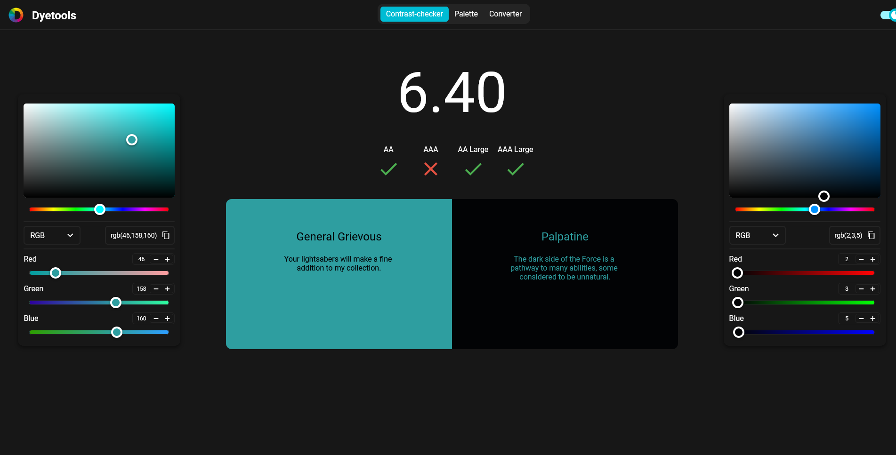
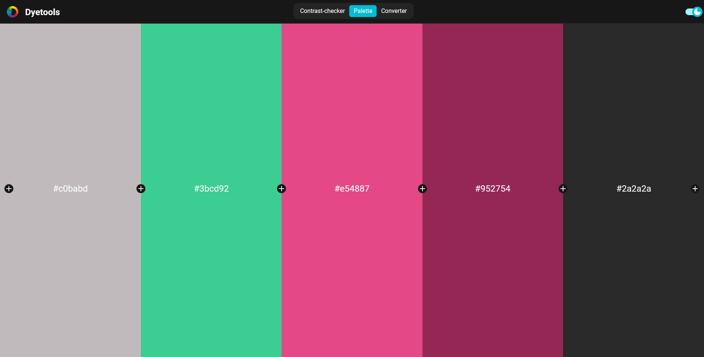
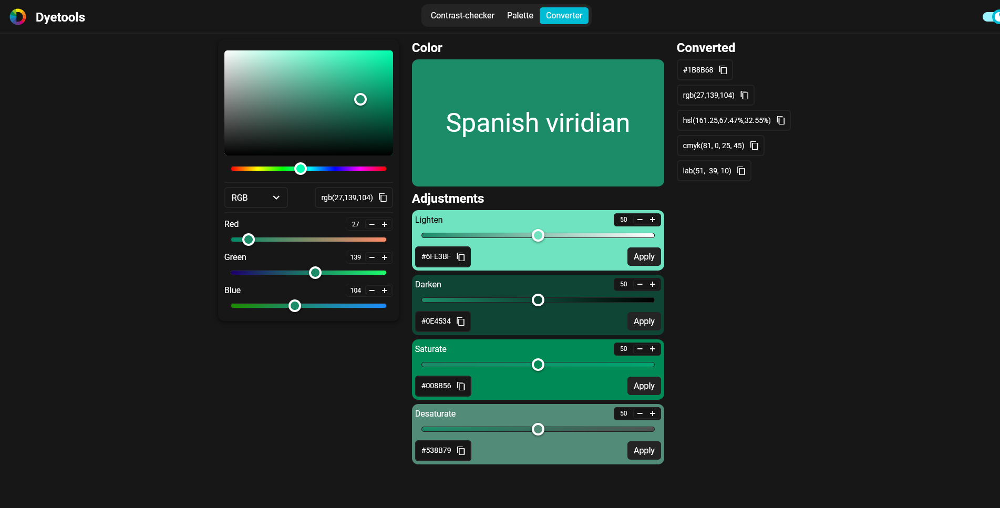

    

# Dyetools

Dyetools is a suite of color tools for designers and developers based on the npm package [chroma-js](https://www.npmjs.com/package/chroma-js).

With Dyetools, you can test your color combinations for [WCAG 2](https://en.wikipedia.org/wiki/Web_Content_Accessibility_Guidelines) requirements, generate color palettes and convert colors from one format to another.

This tool is available here: [https://dyetools.zmarc.de](https://dyetools.zmarc.de)

> This repository contains the new and improved version 2.0 of Dyetools. You can find version 1.0 here: [Dyetools Version 1.0](https://github.com/Blechlawine/contrast-checker)

## Features

- WCAG 2 color contrast checking
- generating color palettes with up to 10 colors
- converting colors from one representation to another
- light and dark mode

## Screenshots

